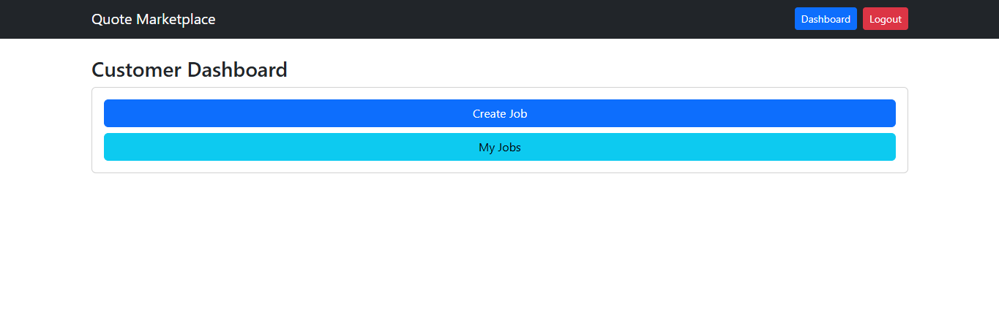
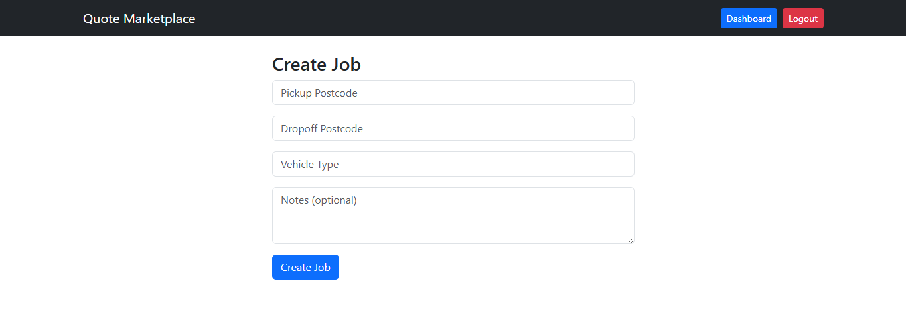
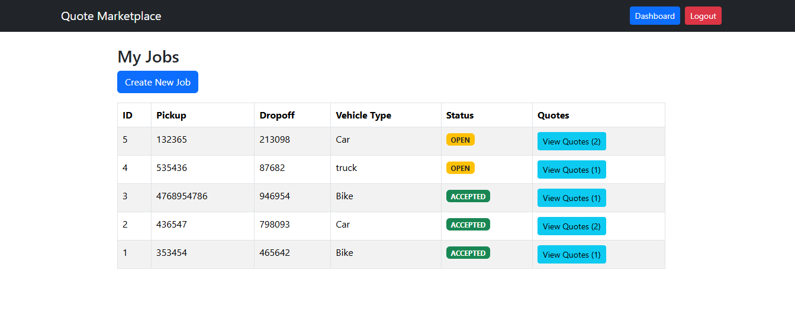
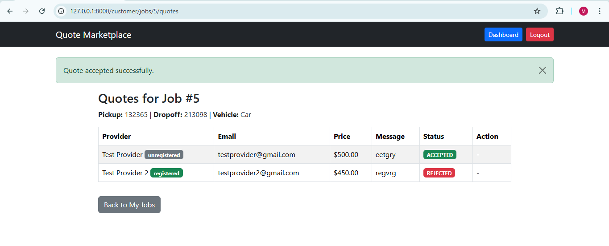
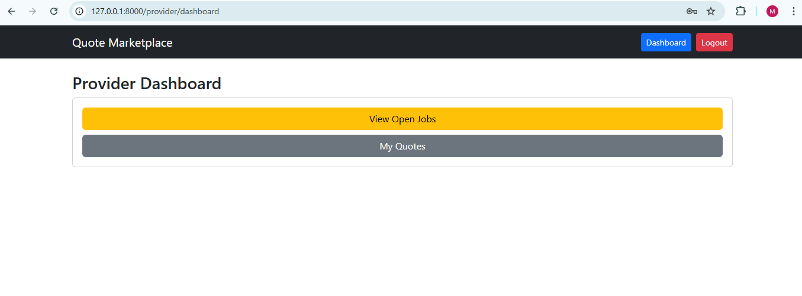
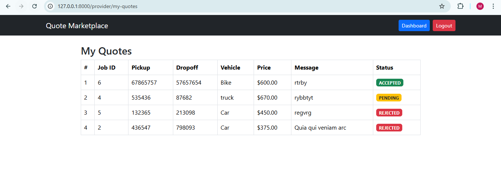
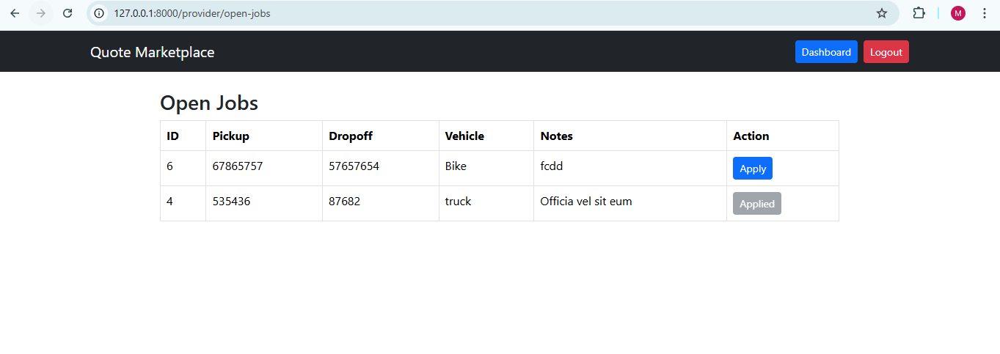
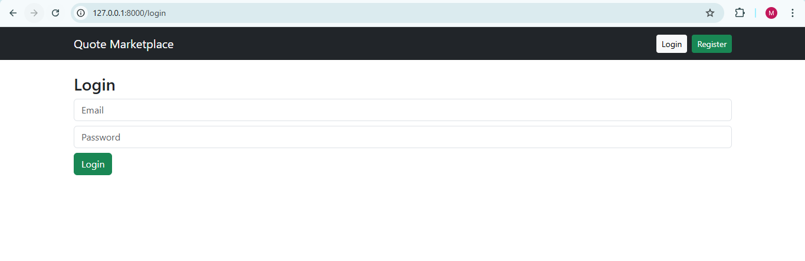
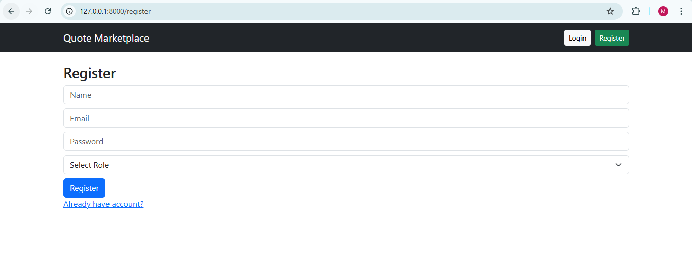

Quote Marketplace (Laravel Web App)

A mini Laravel application where customers can post jobs and providers can submit quotes.

---

Requirements

- PHP 8+
- Composer
- MySQL

---

Setup

1. Clone the repository

git clone https://github.com/mafzalah/quote-marketplace.git

cd quote-marketplace

2. Install dependencies

composer install

3. Copy environment file

copy .env.example to .env

4. Generate application key

php artisan key:generate

5. Update database settings in .env:

DB_CONNECTION=mysql
DB_HOST=127.0.0.1
DB_PORT=3306
DB_DATABASE=quote_db
DB_USERNAME=root
DB_PASSWORD=

6. Run migrations and seeders

php artisan migrate --seed

7. Run the app

php artisan serve

Visit http://127.0.0.1:8000

---

Seed / Test Accounts

Customer
Email: customer@test.com
Password: 123456

Provider (Registered)
Email: provider1@test.com
Password: 123456

Provider (Unregistered)
Email: provider2@test.com
Password: 123456

---

Features

- Customers can create jobs with:
  - Pickup postcode
  - Dropoff postcode
  - Vehicle type
  - Notes (optional)
- Customers can view their jobs
- Customers can view quotes for each job
- Customers can accept one quote only (others are automatically rejected)
- Providers can view open jobs
- Providers can submit quotes
- Providers can view their submitted quotes
- Provider badge (Registered / Unregistered) is displayed to customers

---

Bonus Feature

- Feature test ensures that accepting one quote rejects the others automatically

php artisan test

---

Notes

- Role and provider badge are stored in the users table.
- Jobs are stored in customer_jobs.
- Quotes are stored in quotes.

## Screenshots

**Customer Dashboard**

**Customer Create Job**

**Customer My Jobs**

**Customer Quote Accept**

**Provicer Dashboard**

**Provicer My Quotes**

**Provicer Open Jobs**

**Login**

**Register**

